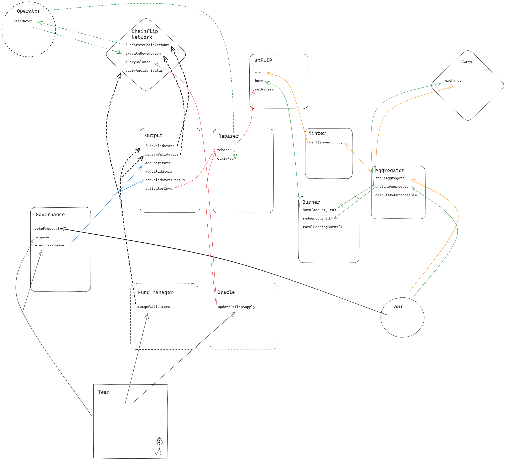

# Summary

This repository contains the forge project used to develop, test and deploy the StakedFLIP contracts.

## Repository Structure

```
test
├── Aggregator.t.sol                | Comprehensive aggregator fuzz tests
├── Burner.t.sol                    | Comprehensive burn fuzz tests
├── MainMigration.sol               | Shared deployment for all tests
├── Minter.t.sol                    | Comprehensive minter fuzz tests
├── Output.t.sol                    | Comprehensive output fuzz tests
├── Rebaser.t.sol                   | Comprehensive rebaser fuzz tests
├── Token.t.sol                     | Some token tests
├── Upgrade.t.sol                   | Some upgrade tests
├── Voting.t.sol                    | Some voting related tests
src
├── mock
│   ├── Flip.sol                    | Mock ERC20 token used in tests
│   ├── ICurveDeployer.sol          | Curve factory interface for tests
│   ├── IStableSwap.sol             | Curve Pool interface for Aggregator
│   └── StateChainGateway.sol       | Mock of the Chainflip staking contract
├── token
│   ├── stFlip.sol                  | stFLIP main token
│   └── tStorage.sol                | stFLIP's variables
└── utils
    ├── AggregatorV1.sol            | Aggregator implementation
    ├── BurnerV1.sol                | Burner implementation
    ├── MinterV1.sol                | Minter implementation
    ├── OutputV1.sol                | Output implementation
    ├── Ownership.sol               | Shared ownership contract
    └── RebaserV1.sol               | Rebaser implementation
```

# Repository Overview
Chainflip is a cross-chain DEX for performing native cross-chain swaps (swapping ETH -> BTC trustlessly and without wrapping for example). They accomplish this by having a 150 validator network with a threshold signature scheme to control addresses on supported chains. Read more about their project [here](https://docs.chainflip.io/concepts/welcome), although the necessary information to understand StakedFLIP is below. This will start as a high level overview and then become more detailed. StakedFLIP is a liquid staking token for the Chainflip network. Users can stake or purchase (or a combination of the two via the Aggregator!) a greater amount of stFLIP than FLIP given. This FLIP will then be staked to validators. As validators accrue rewards, StakedFLIP will rebase to distribute protocol rewards to holders (stFLIP is always backed 1:1 by stFLIP). There are many similarities to Lido. 

## Introductory Sketch
This diagram gives a brief overview of how the system works to aid in the understanding of the more detailed description below.



# Contracts

## stFLIP Token Contract

This ultimately is the hub of the protocol. stFLIP is a rebasing and voting token, using OZ's `VotesUpgradeable`. 
### Rebase Factor
stFLIP has a `preSyncSupply` and `rewardsToSync` which is updated to match the supply of the FLIP backing. Shares are the actual values stored in the contract storage, and these are converted to actual "balance" in `balanceOf` by calculating where the current total supply is in the reward distribution and multiplying by the user's percentage of the shares. `VotesUpgradeable` is responsible for the core underlying balance and transfer functionality of the token. For every mint, burn, and transfer, we call `transferVotingRights` which creates a new checkpoint with the latest total underlying supply for mints/burns and then creates a new shares checkpoint for from/to addresses. We made some tiny [modifications](https://github.com/thunderhead-labs/openzeppelin-contracts-upgradeable) to `VotesUpgradeable` to have all addresses delegated to themselves.   
After the Rebaser invokes a rebase, `preSyncSupply`, `rewardsToSync`, `syncEnd` and `syncStart` which initiates the reward distribution interval which will linearly increase the total supply over time.

## Governance

stFLIP is a voting token to ensure that staking is non-custodial and that the protocol is in the hand's of the actual users. We use [FraxGovernorOmega](https://github.com/FraxFinance/frax-governance) to have a two-step optimistic governance model where a multi-sig first proposes a given action, for a certain time period, stFLIP holders will then be able to veto the action if it does not align with their desires. Governance is ultimately necessary for a protocol like this since validator addresses will need to be updated, fees dynamics will change, operators will need onboarding, and its likely that the underlying Chainflip protocol experiences significant changes. We see governance tokens for LST protocols to be worse than this model since the actual users still don't have a say. Depending on the action there will be a different proposal time period required. Contract upgrades will be on the much longer end, while whitelisting new validators will be on the shorter end. If users do not like a prospective operator etc, they can veto the action. Governance should not be opt-in since users likely won't see the value of this protection over the additional gas costs. The testing of the Omega deployment is in progress - our use does not require any modifications of Omega. 

## Minter contract

This is the most simple contract. Users can approve FLIP to be spent by the Minter, and then call `mint` which will transfer some amount of FLIP to the `Output` and mint the user an equal amount of stFLIP. 

## Burner contract

This contract handles the stFLIP redemption. Users can `burn` some amount of stFLIP to enter the burn queue, and once there is sufficient FLIP in the Output contract a user can `redeem` to receive their native FLIP. 
### Details
Burns are represented in an array of `burn_` structures that contain `amount`, `user`, `completed`. After every burn, stFLIP is burnt, a new entry is added to the `burns` list with the `amount` and `recipient`, and `amount + sums[sums.length - 1]` is pushed to the sums array, which is a cumulative sum of all the previous burns at a given index. After a redemption, `amount` FLIP is transferred to `user` and `completed` is marked true; `redeemed`, a cumulative count of all FLIP that has been claimed, is incremented by `amount`. A burn is redeemable if `sums[burnId]` (the cumulative sum of all burns prior to and including `burnId`) minus `redeemed` is less than or equal to the FLIP balance of the Output contract. This invariant ensures that a burn is only eligible to be claimed once there is sufficient FLIP for all previous burns to be fulfilled.  

`getAllBurns`, `getBurns`, `getBurnIds` are getter functions used by the frontend. `totalPendingBurns` is used by the Rebaser contract. 

## Aggregator Contract
This is the primary avenue that users will stake/unstake through. After parameters are calculated on the frontend, `stakeAggregate` will route the user through Curve and Minter to maximize stFLIP received, and `unstakeAggregate` will instant burn (burn + redeem) and burn or sell through Curve depending on whether they accept the possible discount.
### Stake Aggregate
This function takes a specified amount of FLIP and swaps a specified `amountSwap` and stakes the rest via Minter. 

#### Calculate Optimal Purchase Amount
Due to their backing's illiquid nature, liquid staking tokens inherently trade at a discount. Prior to withdrawals, Lido would often sit at a 3-5% discount. Users would still stake normally, which does not make any sense since it is significantly more advantageous to purchase the LST at a discounted rate. The question remains though - what is the optimal amount of LST to purchase for a given pool state. The key idea is that you never want to receive less units of LST than units of native token you are selling. As you continue to purchase more LST the discount will lessen, and eventually disappear. Naively, you could find the maximum amount where average purchase price is less than 1. But, even though your average price is advantageous, there still might be some marginal purchases that are not. Thus, we find that the optimal amount of LST to purchase is the amount where the marginal cost is 1. 
#### Finding this value
Finding this value analytically is non-trivial and unnecessary. We first have `_marginalCost` for a given `amount` which approximates `dy` after a swap for `amount` by calculating the slope of the line between points `(amount, get_dy(amount))` and `(amount + 10**18, get_dy(amount + 10**18))`. We now want to find the amount where marginal cost becomes one - the point at which it is no longer advantageous to purchase more LST.  
We find this value via binary search in `calculatePurchasable` where we search possible amounts to find an amount where the marginal cost is within `targetError` of our `targetPrice`. This method has accuracy to < 1 bps easily. If this `amountPurchasable` is greater than the amount the user wants to stake, then their entire route will go through Curve.
### Unstake Aggregate
This function takes a specified amount of stFLIP and instant burns (an atomic burn and redeem) and either normal burns or sells the rest. 
#### Parameter Choice
The max amount instant burnable is `FLIP.balanceOf(output) - totalPendingBurns`. If this exceeds user unstake amount then this will be their entire route. For the potential remainder, they can opt on the frontend to accept the price via Curve or perform a normal burn. 
### Curve Pool
We have spoken with the curve team and they have confirmed that their upcoming [stableswap-ng](https://github.com/curvefi/stableswap-ng/pull/30) will support rebasing tokens. It is possible we have to adopt the interface for the new pool's specification.
## Output Contract
This contract manages all staking operations and keeps a running tally of amount staked/unstaked for use in Rebaser reward calculation. Governance can add operators and whitelist validators. Due to the complexities of Chainflip staking mechanics, we have an offchain service known as the Fund Manager which performs staking operations.
### Background on Chainflip Staking Mechanics
The FLIP token is an erc20 token, but in order to stake it, you must call `fundStateChainAccount` on the `stateChainGateway` which will take FLIP from an account an issue it to a `bytes32` address on the State chain (term for Chainflip network). To unstake (redeem) FLIP, the validator must issue a claim request; the validator network will then sign a threshold signature to `registerRedemption` on the `stateChainGateway`. One can then `executeRedemption` to process and have the FLIP sent to the address specified in the claim.   

Chainflip's staking is slightly different than other networks due to the fact that changing validators requires creating rotating keys for the Vaults. The authority (validator) set is determined by an epoch (28 day) [long auction period](https://auctions-perseverance.chainflip.io/). In the first half of the auction, people are free to fund/redeem from their state chain account but are required to keep their bond. In the second half of the auction, you can only stake to your state chain account. At the end of the epoch, the top 150 validators by stake are selected to be the new authority set. Validators are free to redeem FLIP above the network's minimum active bid for the first half of the next epoch. More info [here](https://docs.chainflip.io/concepts/validator-network/validator-auctions-bonds-and-rewards).   
### Adding Operators and Validators
For the foreseeable time after launch, Thunderhead will be the only entity running validators. After we decide to onboard more, we will go through a rigorous vetting process (similar to Lido, which we have gone through) of potential new operators. After selecting new operators, governance can add them via `addOperator`, of course, stFLIP holders can reject this if they please. This new operator will be given a number of addresses that they can add via `addValidators`. These addresses will not be eligible to be staked to though, since the withdrawal address is specified via a transaction on the statechain. After validators are added, governance must validate that the state chain addresses have the withdrawal address set to the Output to ensure that the contracts remain in control of the funds.   
Each operator has a `serviceFeeBps` and a `validatorFeeBps`, the former is the percentage of the rewards that will go to the StakedFLIP service proviers and the latter is the percentage of rewards that go to the operator. 
### Staking/Unstaking
#### Fund Manager
Near the end of each auction, the fund manager will maximize the number of validators that hit the median active bid (we go above the minimum to ensure all validators are included) while fulfilling all burn requests. The Fund Manager can call `fundValidators` with a list of validators and amounts to stake FLIP to whitelisted addresses. The fund manager can also call `redeemValidators` with a list of addresses to execute redemptions and claim the unstaked FLIP.
#### Accounting
After every stake of `amount` to a validator, the validator's operator's `staked` counter will increase by `amount`. After every unstake of `amount` from a validator, the validator's operator's `unstaked` counter will increase by `amount`. The Rebaser uses these amounts to calculate the amount of rewards earned. 
## Rebaser Contract
The Rebaser takes in a list of validator addresses and balances from an offchain oracle and adjusts the scaling factor accordingly while distributing fees to operators who generated rewards. The execution goes `rebase` -> `_updateOperators` -> `_updateOperator` -> `_validateSupplyChange` -> `stflip.setRebase` but we will explain it from the ground up
### Supply Change Validation
We must ensure that the calculated supply chain makes sense incase the oracle is faulty. We calculate the APR in case of supply increase and ensure it does not exceed the reasonable APR of the network (~20%). If the supply decreases, we ensure that the decrease is nominal since slashing is rare on Chainflip. 
### Update Operator
Given an Operator's actual current state chain balance and whether or not a fee should be distributed (this might be disabled if there is a significant slashing), we calculate the rewards generated by comparing their current balance to the staked/unstaked counter found in the Output.  
We calculate the principal balance as `totalStaked + totalRewards - unstaked - slashCounter`. The reward increment is the actual operator balance minus this value. If negative, we increment the slash counter and continue. If positive, we check that it exceeds the `slashCounter`, if it doesn't, we subtract it from `slashCounter`. If it is, we subtract the existing `slashCounter` from the reward increment and set `slashCounter` to zero.* We then increment the service and operator pending fee by this value multiplied by the fee. 

** In this way, `totalRewards` is a slight misnomer because it does not encapsulate total rewards earned. We do this though to ensure that an operator is not earning fees if they have a slashed deficit.

### Update Operators
This takes an array of validators and their balances. It queries the Output contract for the validators Id's and countable status and confirms that the hash of the inputted validators equals the values of the addressses in the contract. It loops through these values to find the total operator balance and then calls `_updateOperator` for each operator. 

### Supply Calculation
After updating all operators and summing the balances of all validators, `totalSupply = stateChainBalance + flip.balanceOf(Output) - burner.totalPendingBurns() - servicePendingFee - totalOperatorPendingFee`. The amount that hasn't been claimed by operators or users who have burned must be subtracted from the amount of FLIP within the system.

### Rebase
An offchain oracle that we will run queries all the validator addresses on the Output, queries their balance on the statechain, and submits this data via `rebase` to the Rebaser. This function ultimately adjusts the supply and distributes rewards to operators and the service via pending fees. The supply validation ensures safety in the case of oracle compromise. As Chainflip becomes more mature we will look to onboard with something like Chainlink.

### Claim Fee
The manager or fee recipient of an operator can `claimFee` to receive an `amount` or `max` of their `pendingFee` in either FLIP or stFLIP. After receiving their funds, `pendingFee` is decreased.

## Conclusion
This gives a solid explanation of the StakedFLIP protocol. Please reach out if you have further questions. 


## Contract Addresses
| Contract          | Proxy                                      | Implementation                             |
|-------------------|--------------------------------------------|--------------------------------------------|
| stFLIP            | [0x961D4921e1718E633BAC8Ded88c4a1cAe44b785a](https://etherscan.io/address/0x961D4921e1718E633BAC8Ded88c4a1cAe44b785a) | [0xe47394531ca17f9aec40dbbe920fb6d04c5ae605](https://etherscan.io/address/0xe47394531ca17f9aec40dbbe920fb6d04c5ae605) |
| Output            | [0x6345A9F7e7069D478FFF3595f1522f28d8405151](https://etherscan.io/address/0x6345A9F7e7069D478FFF3595f1522f28d8405151) | [0x8ed99d9c19c95c632659f7b683e4511bdc639503](https://etherscan.io/address/0x8ed99d9c19c95c632659f7b683e4511bdc639503) |
| Rebaser           | [0x695D1ce0E1Dd5Fca03Bed74c35A407BdEE06636a](https://etherscan.io/address/0x695D1ce0E1Dd5Fca03Bed74c35A407BdEE06636a) | [0x358660c720cf0303e6210651ffbbb25fadd92c5e](https://etherscan.io/address/0x358660c720cf0303e6210651ffbbb25fadd92c5e) |
| Burner            | [0xb4078E779F4a982f27109522E2BA07dd9E133252](https://etherscan.io/address/0xb4078E779F4a982f27109522E2BA07dd9E133252) | [0x91e9c920fd77da76a8e7f5faa3f6cd0d96be7c3b](https://etherscan.io/address/0x91e9c920fd77da76a8e7f5faa3f6cd0d96be7c3b) |
| Aggregator        | [0x38d8d03dFA9554D2232D4249EB23c48c23a24fA4](https://etherscan.io/address/0x38d8d03dFA9554D2232D4249EB23c48c23a24fA4) | [0xb63e67f54a2070e8b0e15a5a5a946dbb8e503966](https://etherscan.io/address/0xb63e67f54a2070e8b0e15a5a5a946dbb8e503966) |
| Minter            | [0xb6ff055b901b8c2d37d55da1f1daaea956136350](https://etherscan.io/address/0xb6ff055b901b8c2d37d55da1f1daaea956136350) | [0xcec4a4f5c476dcefcb26d037200b498f2ca01e62](https://etherscan.io/address/0xcec4a4f5c476dcefcb26d037200b498f2ca01e62) |
| FLIP              | [0x826180541412D574cf1336d22c0C0a287822678A](https://etherscan.io/address/0x826180541412D574cf1336d22c0C0a287822678A) | N/A                                        |
| StateChainGateway | [0x6995ab7c4d7f4b03f467cf4c8e920427d9621dbd](https://etherscan.io/address/0x6995ab7c4d7f4b03f467cf4c8e920427d9621dbd) | N/A                                        |
| FraxGovernorOmega | [0xBCB25d7582D0738a77508096B05488d49181b255](https://etherscan.io/address/0xBCB25d7582D0738a77508096B05488d49181b255) | N/A                                        |
| ProxyAdmin        | [0x620CbdF6ec660CC559F9bBC28DB385bbeB8D0D77](https://etherscan.io/address/0x620CbdF6ec660CC559F9bBC28DB385bbeB8D0D77) | N/A                                        |
| Alphasig          | [0xfBAa992a9E04e6a4Fd1Ba52d49c9c12baa0dA3C6](https://etherscan.io/address/0xfBAa992a9E04e6a4Fd1Ba52d49c9c12baa0dA3C6) | N/A                                        |
| Contractsig       | [0x7a8A1e6966Ac5b67Aca3C9308Fa798Bb56ECAC38](https://etherscan.io/address/0x7a8A1e6966Ac5b67Aca3C9308Fa798Bb56ECAC38) | N/A                                        |
| Pausersig         | [0x91B8441D1F57748629FBE5d814A9d2F471AbBAaA](https://etherscan.io/address/0x91B8441D1F57748629FBE5d814A9d2F471AbBAaA) | N/A                                        |
#### ABI

The ABIs are in `abi/`

The file structure is `abi/<ContractName>.json`. For example `abi/Aggregator.json` is the ABI of the `Aggregator` contract.

The script `filter_abi.py` reads through the `out` folder created by Foundry during the build process. As the files created during the build process contain significant redundant information, and change on every build, it does not make sense to push these to GitHub. Please run `filter_abi.py` after making contract changes and prior to committing. This can be made into an action or commit hook later. 

  